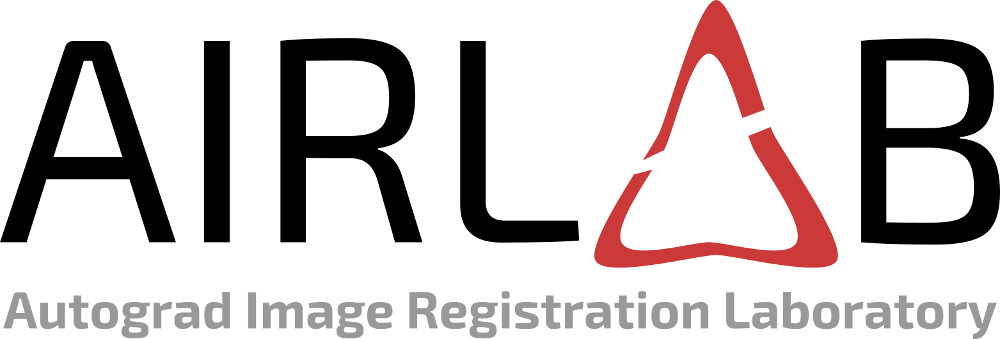

# Autograd Image Registraion Laboratory
AirLab is an open laboratory for medical image registration. It provides an environment
for rapid prototyping and reproduction of registration algorithms. The unique feature of AirLab is, that the analytic gradients of the objective function are computed automatically with fosters rapid prototyping. In addition, the device on which the computations are performed, on a CPU or a GPU,
is transparent.
AirLab is implemented in Python using [PyTorch](https://pytorch.org/) as tensor and optimization library and SimpleITK for basic image IO. It profits therefore from recent advances made by the machine learning community.

AirLab is not meant to replace existing registration frameworks nor it implements deep learning methods only. It is rather a laboratory for image registration algorithms for rapid prototyping and reproduction. Furthermore, it borrows key functionality from PyTorch (autograd and optimization) which is of course not limitted to deep learning methods.

We refer to our arXiv preprint [2018](https://arxiv.org/abs/1806.09907) for a detailed introduction of AirLab and its feature.

Authors: Robin Sandkuehler and Christoph Jud

[Documentation](https://airlab.readthedocs.io/en/latest/index.html)

Follow us on Twitter  to get informed about the most recent features, achievements and bugfixes.

## Getting Started
1. Clone git repository: `git clone https://github.com/airlab-unibas/airlab.git`
2. Make sure that following python libraries are installed:
  1. pytorch
  2. numpy
  3. SimpleITK
  4. matplotlib
They can be installed with `pip`.

We recommend to start with the example applications provided in the `example` folder.

##### A Note on CPU Performance
The convolution operation, which is frequently used in AirLab, is performed in PyTorch. Currently, its CPU implementation is quite memory consuming. In order to process larger image data a GPU is required.

## Dependencies
The project depends on following libraries: 
* [PyTorch](https://pytorch.org/)
* [NumPy](www.numpy.org/)
* [SimpleITK](www.simpleitk.org/)
* [Matplotlib](https://matplotlib.org/)

## History
The project started in the [Center for medical Image Analysis & Navigation](https://dbe.unibas.ch/en/research/imaging-modelling-diagnosis/center-for-medical-image-analysis-navigation/) research group of the [University of Basel](http://www.unibas.ch). 

##### Authors and Contributors
* **Robin Sandkuehler** - *initial work* _(robin.sandkuehler@unibas.ch)_
* **Christoph Jud** - *initial work* _(christoph.jud@unibas.ch)_
* **Alina Giger** - *presentation support*
* **Reinhard Wendler** - *logo design support*
* **Philippe C. Cattin** - *project support*

## License
AirLab is licensed under the Apache 2.0 license. For details, consider the LICENSE and NOTICE file.

If you can use this software in any way, please cite us in your publications:

[2018] Robin Sandkuehler,  Christoph Jud, and Philippe C. Cattin. "AirLab: Autograd Image Registration Laboratory". arXiv preprint arXiv:1806.09907, 2018. [link](https://arxiv.org/abs/1806.09907)

### Contributing
We released AirLab to contribute to the community. Thus, if you find and/or fix bugs or extend the software please contribute as well and let us know or make a pull request. 

### Other Open Source Projects
AirLab depends on several thirdparty open source project which are included as library. For details, consider the NOTICE file.

